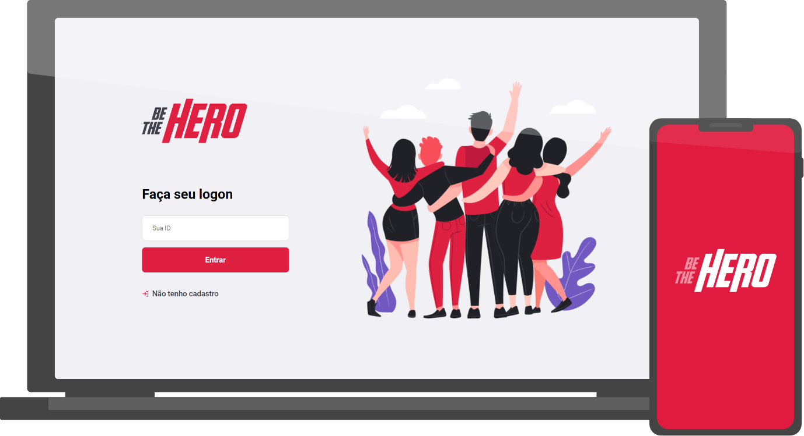

<h1 align="center"> 
  
</h1>
<p align="center"> Projeto desenvolvido durante a <strong>Semana OmniStack 11.0</strong> da <strong>RocketSeat</strong>! 🚀 </p>

<p align="center">
  </img>
  
  
</p>

<p align="center">
  <a href="#-o-projeto">📓 O Projeto</a>&nbsp;&nbsp;&nbsp;|&nbsp;&nbsp;&nbsp;
  <a href="#-tecnologias"> 🔧 Tecnologias</a>&nbsp;&nbsp;&nbsp;|&nbsp;&nbsp;&nbsp;
  <a href="#-como-testar">💡 Como Testar</a>&nbsp;&nbsp;&nbsp;|&nbsp;&nbsp;&nbsp;
  <a href="#-certificado">📝 Certificado</a>&nbsp;&nbsp;&nbsp;
</p>

## 📓 O Projeto

<p>O app <strong>Be The Hero</strong> foi desenvolvido com a finalidade de proporcionar às ONG's a possibilidade de encontrar colaboradores de forma mais prática.</p>
<p>Com ele, as ONG's podem entrar no site, se cadastrar e publicar os casos que estiverem precisando de apoio financeiro para que assim qualquer pessoa com o app Mobile (Android ou iOS) possam visualizar os casos e entrarem em contato via E-mail ou WhatsApp.</p>


## 🔧 Tecnologias

<p> As principais tecnologias utilizadas nesse projeto foram:</p>
</img>
</img>
</img>

## 💡 Como Testar

<p>Com as ferramentas necessárias instaladas (<a href="https://nodejs.org/en/">Node</a>, <a href="https://classic.yarnpkg.com/pt-BR/docs/install">Yarn<a> e <a href="https://expo.io/">Expo</a>) basta abrir um terminal do <a href="https://git-scm.com/downloads">Git</a> na raiz da pasta desse repositório e digitar os seguintes comandos:</p>

### Para Instalar
```sh
$ git clone https://github.com/lucasalme1da/be-the-hero
$ cd be-the-hero
$ npm install
```

### Inicializando Back-End da Aplicação
```sh 
$ cd backend
$ npm start
```

### Inicializando Front-End da Aplicação
```sh
$ cd frontend
$ npm start
```

### Inicializando Mobile da Aplicação
```sh
$ cd mobile
$ npm start
```

## 📝 Certificado

<p> Semana Omnistack 11.0 - <a href="certificado.pdf">OK</a>!</p>

---

<p> Feito com ❤ por <a href="https://www.linkedin.com/in/lucasalme1da">Lucas Almeida</a> :D </p>


